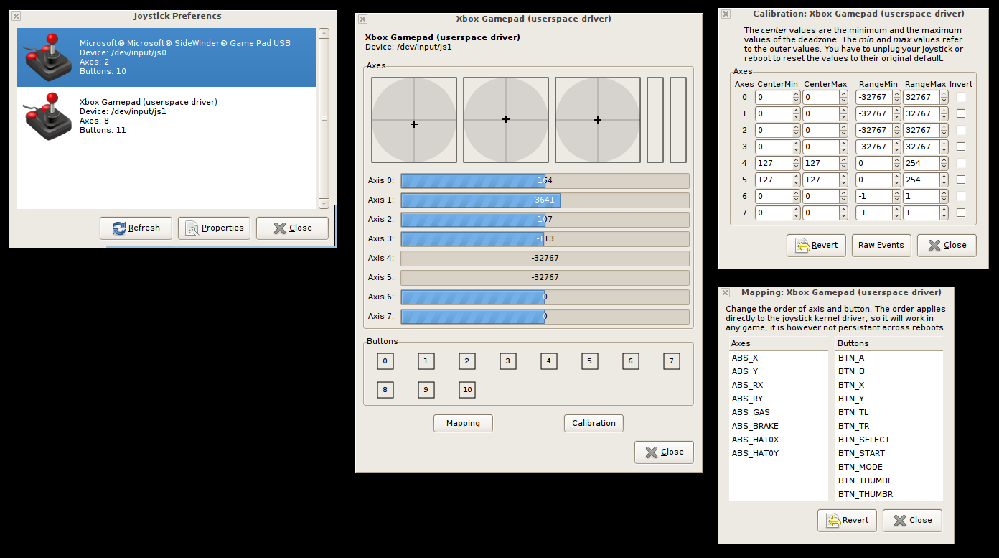

If you haven't yet, please check out [part one](https://websdev.io/posts/a-usb-controller-py-and-pi/) of this series of blog posts for context! :)

A quick and dirty recap; I've a 3rd party **USB Gamecube controller**, a **Raspberry Pi 3**, and a **large image file** displayed using **[Feh](https://feh.finalrewind.org/)** that I intend to scroll, pan, and zoom around using the controller. How do I accomplish this?

## Challenges:
* Read the USB device data in Linux
* Interpret or decode that data
* Map the input data to manipulate the image file in Feh
* Launch the script & image viewer on Pi startup

I began by searching for any existing libraries or software that could manage the first two bullet points for me. This lead me to [jstest-gtk](https://jstest-gtk.gitlab.io/), a joystick testing & configuration tool for Linux. And... it worked! Kind of. It only read *some* my 3rd party controller's inputs, and aside from that, didn't feature an easy way to remap keys the way I'd have liked to. However, as a complete Linux newbie I was quite thankful that it introduced me to the usb device input interface.



> Screenshots of the [jstest-gtk](https://jstest-gtk.gitlab.io/) GUI courtesy their website

As luck would have it, investigating the device input interface lead directly to stumbling upon an [incredibly useful SO thread](https://stackoverflow.com/questions/16032982/getting-live-info-from-dev-input) breaking down *exactly* what I was looking for. Below is a piece of code borrowed from a post in that thread that listens for, decodes, and prints the data coming from the USB controllers file path `/dev/input/js0`. I'll walk through what I've learned from it.

```python
infile_path = "/dev/input/js0"
EVENT_SIZE = struct.calcsize("LhBB")
file = open(infile_path, "rb")
event = file.read(EVENT_SIZE)
while event:
    print(struct.unpack("LhBB", event))
    (tv_msec,  value, type, number) = struct.unpack("LhBB", event)
    event = file.read(EVENT_SIZE)
```

The data being streamed from the USB device comes in the form of a **struct**, a C-language data type that holds several related pieces of packaged data. As noted in the post, the joystick event struct represents four pieces of information about the event: 
 * A timestamp
 * The value, represented as a 1 or 0 for button inputs or an integer in between -32767 and 32767 for a joystick's position on an axis
 * The type of event, which tells you whether the input is a button or an axis 
 * A number that corresponds to the input that was pressed

```c
struct js_event {
    __u32 time;     /* event timestamp in milliseconds */
    __s16 value;    /* value */
    __u8 type;      /* event type */
    __u8 number;    /* axis/button number */
};
```

> The event struct as defined in the Linux kernel source file, [/linux/joystick.h](https://github.com/torvalds/linux/blob/master/include/uapi/linux/joystick.h).

Python provides methods to convert structs to usable values, provided a **format string** that represents the expected data within the struct. [This chart](https://docs.python.org/2/library/struct.html#format-characters) provides mapping to construct the correct format string for the struct you are handling.

Ok! Below, I'll work my way down the code block.

```python
infile_path = "/dev/input/js0"
EVENT_SIZE = struct.calcsize("LhBB")
```

The first line declares the path to the USB input device. The second is one of Python's struct methods, passed a format string representing the joystick event struct listed above to calculate the size of the struct.

```python
file = open(infile_path, "rb")
event = file.read(EVENT_SIZE)
```

A `file` object is returned from the `open()` function, with the path to the controller and "rb" as arguments; r for read and b for binary. Then, the `read()` method of the returned `file` object is invoked with the *size of the struct*, limiting the read to only the size of one event. This starts a blocking read of the file which waits for data to be written from the input.

```python
while event:
    print(struct.unpack("LhBB", event))
    (tv_msec,  value, type, number) = struct.unpack("LhBB", event)
    event = file.read(EVENT_SIZE)
```

Upon a write to the device path, another of Python's struct methods `unpack()` is passed the format string and the incoming struct. `unpack()` returns a tuple containing the converted data, as you can see from the declared tuple on third line above, and the last line prepares for the next write to the controller's file.

Awesome! That's a solid foundation of code and understanding of how to read and interpret a USB controller's inputs on a Raspberry Pi. Halfway there!

Join me soon for the final post in this three part series. I promise I'll get this one out sooner! :P

Part 3: Finalizing the Python controller script

--Michael

> Questions? Comments? Find me on Twitter at https://twitter.com/_websdev